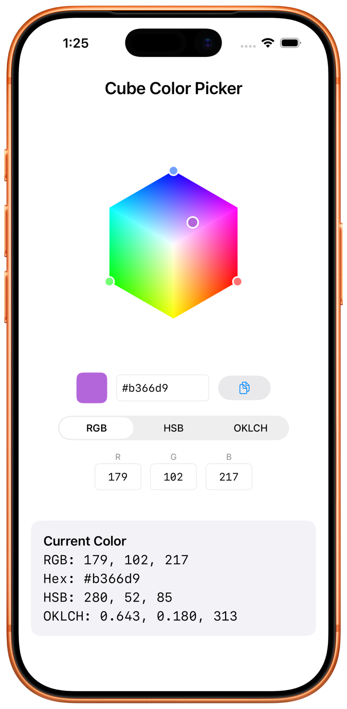

# CubeColorPicker (iOS)

A SwiftUI port of [cube-color-picker](https://github.com/cwooddgr/cube-color-picker) — a 3D isometric cube color picker for iOS. Drag axis handles to resize the cube, tap or drag on any face to pick a color.

Supports RGB, HSB, and OKLCH color modes. The color math, isometric projection, and interaction model match the web version.



> **Building for the web?** The TypeScript version lives at [cwooddgr/cube-color-picker](https://github.com/cwooddgr/cube-color-picker).

## Requirements

- iOS 16+
- Swift 5.9+
- Xcode 15+

## Install

Add the package to your Xcode project:

1. File → Add Package Dependencies…
2. Enter the repo URL: `https://github.com/cwooddgr/cube-color-picker-swift`
3. Add the `CubeColorPicker` library to your target

Or in a `Package.swift`:

```swift
dependencies: [
    .package(url: "https://github.com/cwooddgr/cube-color-picker-swift", from: "0.3.0"),
],
targets: [
    .target(name: "MyApp", dependencies: [
        .product(name: "CubeColorPicker", package: "cube-color-picker-swift"),
    ]),
]
```

## Usage

Bind an `RGBColor` to `CubePickerView` and you're done.

```swift
import SwiftUI
import CubeColorPicker

struct ContentView: View {
    @State private var color = RGBColor(r: 128, g: 128, b: 128)

    var body: some View {
        CubePickerView(color: $color)
            .onChange(of: color) { newColor in
                print(ColorMath.rgbToHex(newColor))
            }
    }
}
```

Also bind the active mode if you want the host to observe or drive it:

```swift
@State private var color = RGBColor(r: 180, g: 100, b: 220)
@State private var mode: ColorMode = .oklch

CubePickerView(color: $color, mode: $mode)
```

Pass a `CubePickerConfiguration` to hide sub-parts or change the cube size:

```swift
CubePickerView(
    color: $color,
    configuration: CubePickerConfiguration(
        showSwatch: true,
        showHexField: true,
        showCopyButton: true,
        showModeToggle: false,   // hide the mode toggle
        showChannelInputs: false, // hide the channel inputs
        size: 280
    )
)
```

## Public API

| Symbol | Purpose |
|--------|---------|
| `CubePickerView` | The picker view. Init: `CubePickerView(color:mode:configuration:)`. |
| `CubePickerConfiguration` | Visibility toggles and cube size. |
| `RGBColor`, `HSBColor`, `OKLCHColor` | Color value types. |
| `ColorMode` | `.rgb`, `.hsb`, `.oklch`. |
| `ColorOutput` | Bundle of all four representations (RGB / HSB / OKLCH / hex). |
| `ColorMath.rgbToHex`, `ColorMath.hexToRgb` | Hex string conversion. |
| `ColorMath.rgbToHsb`, `ColorMath.hsbToRgb` | RGB ↔ HSB conversion. |
| `ColorMath.rgbToOklch`, `ColorMath.oklchToRgb` | RGB ↔ OKLCH conversion. |

## Color modes

- **RGB** — Red, Green, Blue. Every point in the cube is a valid sRGB color.
- **HSB** — Hue (0–359°), Saturation, Brightness. Every point is valid.
- **OKLCH** — Lightness, Chroma, Hue. Perceptually uniform. Out-of-gamut colors are automatically clamped by reducing chroma while preserving lightness and hue (binary search).

## Interaction

- **Axis handles** (colored circles on each axis): drag to resize the cube along that axis.
- **Face tap / drag**: tap on a face to place the color dot and select a color. Drag across faces seamlessly.

Touch targets for axis handles are 30pt radius (60pt diameter), exceeding Apple's 44pt minimum. The canvas uses `.highPriorityGesture` so drags started on the cube always reach the picker even when hosted inside a `ScrollView`; start a scroll gesture outside the cube to scroll past it.

## Running the demo app

The demo is generated with [XcodeGen](https://github.com/yonaskolb/XcodeGen):

```bash
brew install xcodegen
cd Demo
xcodegen generate
open CubePickerDemo.xcodeproj
```

Then pick an iOS Simulator and hit ⌘R.

## Running tests

```bash
swift test
```

46 tests cover color math (RGB↔HSB↔OKLCH, gamut clamping, hex parsing, mode conversions) and isometric projection (projection formula, cube vertices, face hit-testing, axis handle positioning).

## Architecture

```
Sources/CubeColorPicker/
├── Models/
│   ├── ColorTypes.swift              # RGBColor, HSBColor, OKLCHColor, ColorMode, ColorOutput
│   └── ColorMath.swift               # All color conversion + gamut clamping
├── Renderer/
│   ├── IsometricProjection.swift     # project(), cubeVertices(), faceHitTest()
│   ├── CubeRenderer.swift            # FaceTextureCache, generateFaceTexture
│   └── CubeRenderer+CG.swift         # Core Graphics scene renderer
├── Interaction/
│   └── CubeGestureHandler.swift      # Drag state machine, cross-face transitions
├── State/
│   └── CubePickerState.swift         # Internal ObservableObject, mode switch animation
├── Platform/
│   └── PlatformViewRepresentable.swift  # UIKit/AppKit typealias shim
├── Debug/
│   └── CubeColorPickerDebug.swift    # solidFaces diagnostic toggle
└── Views/
    ├── CubePickerView.swift          # Public entry point
    ├── CubeSceneRepresentable.swift  # UIViewRepresentable / NSViewRepresentable wrapper
    ├── CubeSceneView.swift           # PlatformView subclass that owns draw(_:) + gestures
    └── ...                           # Internal sub-views (swatch, hex field, mode toggle, etc.)
```

Rendering runs through a `UIViewRepresentable` (+ `NSViewRepresentable` via typealias shim) over a `PlatformView` that overrides `draw(_:)` and paints the whole scene into the provided `CGContext`. Face gradient textures are generated once as 128×128 `CGImage`s and cached per `(fixedAxis, fixedValue, uMax, vMax, mode)` key; they're drawn with a clip to the quad path and an affine that maps the texture's `(u, v)` pixel space onto the projected quad. Gesture handling uses a native `UIPanGestureRecognizer` / `NSPanGestureRecognizer` feeding the existing `CubeGestureHandler` — no SwiftUI `DragGesture`, so there's no gesture competition with host `ScrollView`s to worry about beyond `shouldRecognizeSimultaneouslyWith`.

This architecture replaced a previous SwiftUI `Canvas`-based renderer that exhibited silent face-gradient failures when the picker was embedded under a `NavigationStack` inside a sheet on iOS 26. `CGContext.draw(_:in:)` is a rock-solid primitive that doesn't care what host hierarchy surrounds the view.

## Debugging

`CubeColorPickerDebug.solidFaces = true` swaps the gradient textures for flat per-face debug colors. Useful when diagnosing rendering issues in unusual hosts — if solid faces appear but gradients don't, the gradient-draw path is broken specifically (historically: `SwiftUI.Canvas` + nested hosts). Mutating the flag posts `Notification.Name.cubeColorPickerDebugDidChange`, which the picker view observes to trigger a redraw.

## Release notes

**0.3.0** — Rendering rewrite: the picker now renders via `UIViewRepresentable`
+ Core Graphics instead of `SwiftUI.Canvas`, fixing silent face-gradient
failures when embedded in nested hosts (e.g. sheet + `NavigationStack` on iOS
26). No public API changes — consumers only need to bump the SPM pin.
`CubeColorPickerDebug.solidFaces` is restored.

## License

MIT
